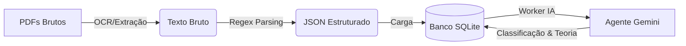

# Simulado AI Pipeline: ETL & Knowledge Base


> **Pipeline de Engenharia de Dados que transforma PDFs de provas não estruturados em uma Base de Conhecimento Inteligente para concursos públicos.**

<p>&nbsp;</p>

## 🎯 Sobre o Projeto

Este projeto resolve a dor de estudantes de concurso que possuem centenas de PDFs de provas (bancas variadas), mas nenhuma forma organizada de estudar, filtrar por matéria ou obter feedback teórico imediato.

O sistema atua como um **Agente Inteligente de Ensino**, automatizando o ciclo de estudos:
1.  **Extrai** questões brutas de arquivos PDF.
2.  **Transforma** e estrutura os dados (JSON) usando Regex e Heurísticas.
3.  **Enriquece** o conteúdo usando IA Generativa (Google Gemini), criando não apenas explicações, mas uma **Taxonomia Automática** e **Material de Apoio Teórico**.

<p>&nbsp;</p>

## 🏗️ Arquitetura da Solução

O projeto segue uma arquitetura de pipeline **ETL (Extract, Transform, Load)** evoluída com uma etapa de **Enriquecimento Inteligente**.



### Diferencial Técnico: Arquitetura de Base de Conhecimento (KB)
Diferente de sistemas comuns que salvam a explicação dentro da questão, este projeto utiliza **Normalização de Banco de Dados** para economizar custos de API e organizar o conhecimento:

* **Tabela `questoes`**: Contém o enunciado, alternativas e link para o tópico.
* **Tabela `topicos`**: Contém o resumo teórico e a fundamentação legal (Lei Seca).
* **Lógica do Agente**: O Worker verifica se o tópico (ex: "Uso da Crase") já existe na base.
    * *Se sim:* Apenas vincula a questão (Custo zero de geração).
    * *Se não:* A IA gera o material teórico e salva na KB para uso futuro.

<p>&nbsp;</p>

## 🚀 Funcionalidades

* **Extração em Lote:** Processamento de múltiplos PDFs simultaneamente com barras de progresso visuais (`tqdm`).
* **Sanitização de Dados:** Limpeza automática de cabeçalhos, rodapés e lixo de formatação (OCR Noise).
* **Classificador via IA:** Identifica automaticamente a **Matéria**, **Assunto** e **Nível de Dificuldade** da questão.
* **Geração de Conteúdo:** Cria resumos didáticos e citações legais para cada tópico novo encontrado.
* **Resiliência:** Sistema de *retry* automático, tratamento de *Rate Limit* da API do Google e verificação de duplicidade (Idempotência).

<p>&nbsp;</p>

## 🛠️ Tecnologias Utilizadas

* **Linguagem:** Python
* **Extração de Dados:** `pdfplumber`
* **Manipulação de Dados:** `pandas`, `json`
* **Inteligência Artificial:** Google Gemini API (`google-generativeai`)
* **Banco de Dados:** SQLite (SQL Relacional)
* **Visualização/Logs:** `tqdm`, `ipywidgets`
* **Ambiente:** Jupyter Notebook

<p>&nbsp;</p>

## 📦 Como Executar

### Pré-requisitos
* Python 3.8+
* Chave de API do Google Gemini (Gratuita no Google AI Studio)

### Instalação

1.  **Clone o repositório:**
    ```bash
    git clone [https://github.com/amaro-netto/alerj_simulado.gi](https://github.com/amaro-netto/alerj_simulado.git)
    cd simulado-ai-pipeline
    ```

2.  **Crie seu ambiente virtual:**
    ```bash
    python -m venv .venv
    # Windows
    .venv\Scripts\activate
    # Linux/Mac
    source .venv/bin/activate
    ```

3.  **Instale as dependências:**
    ```bash
    pip install pdfplumber pandas tqdm google-generativeai python-dotenv ipywidgets
    ```

4.  **Configure a API Key:**
    Crie um arquivo `.env` na raiz do projeto:
    ```env
    GEMINI_API_KEY="sua_chave_aqui"
    ```

### Rodando o Pipeline

O projeto foi estruturado em um **Jupyter Notebook** (`pipeline_simulado.ipynb`) para melhor visualização dos dados.

1.  Coloque seus arquivos PDF na pasta `/pdf`.
2.  Abra o notebook e execute as células sequencialmente:
    * **Fase 1 (ETL):** Extração e geração dos arquivos JSON.
    * **Fase 2 (Carga):** Migração e Carga no Banco de Dados SQLite.
    * **Fase 3 (IA):** Execução do Worker Inteligente para classificação e geração de teoria.

<p>&nbsp;</p>

## 📊 Exemplo de Dados Gerados (JSON Output)

**Questão Processada:**
> *"Assinale a alternativa que apresenta caso proibido de crase..."*

**Enriquecimento via IA (Salvo no Banco):**

```json
{
  "materia": "Português",
  "topico_nome": "Uso da Crase",
  "dificuldade": "Média",
  "explicacao_especifica": "A crase é proibida antes de verbos, por isso a letra B está correta.",
  "material_apoio": {
      "resumo_teorico": "A crase é a fusão da preposição 'a' com o artigo 'a'. Regra geral: não ocorre antes de palavras masculinas e verbos.",
      "citacao_legal": "Gramática Normativa Padrão"
  }
}
```
<p>&nbsp;</p>

## 📝 Autor

<a href="https://github.com/amaro-netto" title="Amaro Netto"></a>
